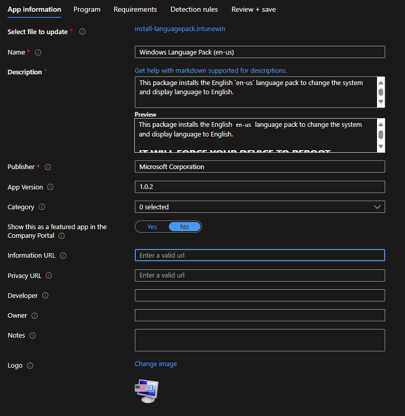
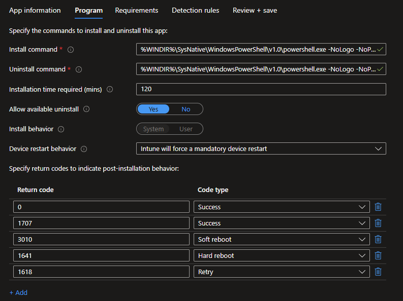
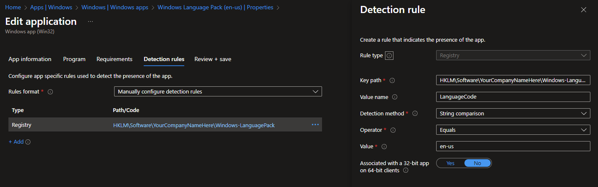

# 🌐 Intune Windows Language Packs 🌐

This repo contains a script to deploy a languagepack using `.cab` files to Windows 11 clients.
The script will deploy the langauge using the `Add-WindowsPackage`-Command and then the client needs to reboot. The script will add a schedule task that will run at startup and change the langauge, this will affect in a second reboot before the user can sign-in so that the Display language will be changed completely. The schedule task will disable itself when running so that it only runs once at the next startup.

## Customizations

### Company Name
Set the company name which will be used for the detection.
``` powershell
# Script settings
$companyName = "YourCompanyNameHere"
```

## Prerequisites
Download the current `mul_languages_and_optional_features_for_windows_11` ISO (available in MSDN), containing the `.cab` files for optional features and languages.
Copy the following files for the language (in this example `en-us`) that you want to deploy into the package folder and create a `.INTUNEWIN` file with them and the `.ps1` script:
- Microsoft-Windows-Client-Language-Pack_x64_`en-us`.cab
- Microsoft-Windows-LanguageFeatures-Basic-`en-us`.cab
- Microsoft-Windows-LanguageFeatures-Handwriting-`en-us`.cab
- Microsoft-Windows-LanguageFeatures-OCR-`en-us`.cab
- Microsoft-Windows-LanguageFeatures-Speech-`en-us`.cab
- Microsoft-Windows-LanguageFeatures-TextToSpeech-`en-us`.cab

## Deployment
Create a `.INTUNEWIN` containing the `install-languagepack.ps1` and all `.cab`-files. Then create a new Intune App from it: 


### Install
Change the value of `-LanguageCode` to the [language code](https://docs.microsoft.com/en-us/windows-hardware/manufacture/desktop/available-language-packs-for-windows) that you want to install:
``` powershell
%WINDIR%\SysNative\WindowsPowerShell\v1.0\powershell.exe -NoLogo -NoProfile -NonInteractive -WindowStyle Hidden -ExecutionPolicy Bypass -File "install-languagepack.ps1" -install -LanguageCode "en-us"
```

### Uninstall
Change the value of `-LanguageCode` to the language code that you want to uninstall:
``` powershell
%WINDIR%\SysNative\WindowsPowerShell\v1.0\powershell.exe -NoLogo -NoProfile -NonInteractive -WindowStyle Hidden -ExecutionPolicy Bypass -File "install-languagepack.ps1" -uninstall -LanguageCode "en-us"
```
<span style="color:cornflowerblue;font-weight:bold">🛈  HINT</span><br/>
    You can select `Intune will forece a mandatory device restart` to directly force the device to reboot so that the language will be applied as the System language and everything will be switched to the language that you installed. A reboot is mandatory for the language to be applied. 



### Detection
Build the Intune detection on the Registry key: `HKLM\Software\$companyName\Windows-LanguagePack` and check the value `LanguageCode` to match the `-LanguageCode` that you selected for install



Made with ❤️ by [Niklas Rast](https://github.com/niklasrst)